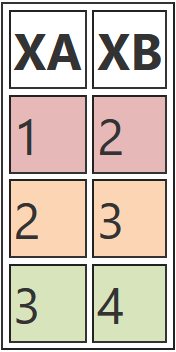
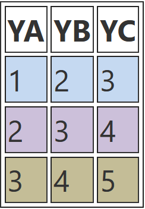
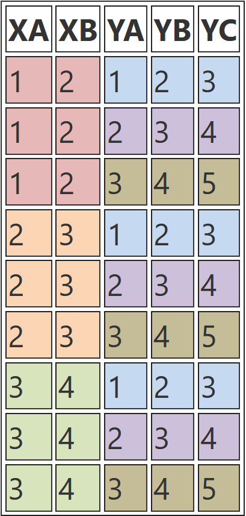

# Vortrag Joins

Diese Dokumentation gibt einen kleinen Einblick über die Verbindungen von Tabellen in SQL. Im Zusammenhang mit entsprechenden Beispielen werden die Vorgestellten Join Arten veranschaulicht.

# Inhaltsverzeichnis
- [Beispieldatenbank](#Beispieldatenbank)
- [Join-Arten](#Join-Arten)
	- [Cross Join](#Cross-Join)
	- [Natural Join](#Natural-Join)
	- [Inner Join](#Inner-Join)
	- [Left Join](#Left-Join)
	- [Right Join](#Right-Join)
	- [Full Join](#Full-Join)
	- [Self Join](#Self-Join)
	- [Apply](#Apply)
- [Quellen](#Quellen)

# Beispieldatenbank

Auf dieser Datenbank basieren die folgenden Beispiele. Das Script ist speziell an T-SQL angepasst und muss daher in entsprechender Umgebung ausgeführt werden.

```sql
--Überprüft ob die Datenbank bereits existiert, wenn nicht dann wird sie neu erstellt.
DECLARE @dbname nvarchar(128)
SET @dbname = N'joinDB'

IF (NOT EXISTS (SELECT name FROM master.dbo.sysdatabases WHERE ('[' + name + ']' = @dbname OR name = @dbname)))
CREATE DATABASE joinDB;

GO
USE joinDB;
GO

DROP TABLE IF EXISTS Kreditkarte;
CREATE TABLE Kreditkarte (
  Kartennummer int PRIMARY KEY,
  Firma nvarchar(100) NOT NULL,
  Inhaber nvarchar(75) NOT NULL,
  Ablaufdatum DATE NOT NULL
);

INSERT INTO Kreditkarte VALUES
    (12345,'VISA','Max Mustermann','2017-05-01'),
    (12346,'Mastercard','Katrin Musterfrau','2018-01-01'),
    (12347,'American Express','John Doe','2015-02-01'),
    (12348,'Diners Club','John Doe','2020-03-01');

DROP TABLE IF EXISTS Rechnungen;
CREATE TABLE Rechnungen (
  RechnungsNr int NOT NULL,
  KundenNr nvarchar(6) NOT NULL,
  Betrag DECIMAL(10,2) NOT NULL,
  Kartennummer int DEFAULT NULL,
  CONSTRAINT c_Kredikarte FOREIGN KEY (Kartennummer) REFERENCES Kreditkarte (Kartennummer)
);

INSERT INTO Rechnungen VALUES
    (98765,'ABX039',49.95,12345),
    (98766,'ABX039',12.95,NULL),
    (98767,'ABX040',79.95,12347),
    (98768,'ABX050',59.99,12347),
    (98769,'ABX050',29.99,12348),
    (98770,'ABX060',99.99,NULL);

DROP TABLE IF EXISTS Kunden;
CREATE TABLE Kunden(
  KundenNr nvarchar(6) NOT NULL,
  Name nvarchar(50) NOT NULL,
  Land nvarchar(50) NOT NULL
);

INSERT INTO Kunden VALUES
    ('ABX039','Lissa Yockey','Deutschland'),
    ('ABX040','Cedric Don','USA'),
    ('ABX050','Jolanda Shontz','Russland'),
    ('ABX060','Naoma Bernardi','Norwegen');
```

# Join-Arten
## Cross Join
Der Cross Join verbindet jede Zeile der ersten Tabelle mit jeder Zeile der Zweiten Tabelle. Die Ergebnistabelle eines Cross Joins ist das Kreuzprodukt der beiden Tabellen und kann daher sehr groß werden und ist häufig nutzlos. 

> Das Kreuzprodukt, lieft als Resultat alle Kombinationsmöglichkeiten beider Tabellen.

#### Syntax

```sql
SELECT  { * | <columnname>[,...]} FROM <tablename1> CROSS JOIN <tablename2>
```

#### Logik

<p float="left">



</p>


#### Datenbankscript

```sql
CREATE DATABASE Essen;
Go
CREATE TABLE Meals(MealName nvarchar(100));
CREATE TABLE Drinks(DrinkName nvarchar(100));
INSERT INTO Drinks VALUES ('Orange Juice'),('Tea'),('Cofee');
INSERT INTO Meals VALUES('Omlet'), ('Fried Egg'), ('Sausage');
```

#### Beispiel

```sql
SELECT CONCAT_WS('-',MealName,DrinkName) AS MenuList FROM Meals CROSS JOIN Drinks;
```

> `CONCAT_WS` = concatenate with separator (dt. mit Trennzeichen verketten)


## Natural Join

Der Natural Join verknüpft die beiden Tabellen über die Gleichheit der Felder, in Spalten mit gleichem Namen. Spalten mit gleichem Namen werden im Ergebnis nur einmal angezeigt. Haben die Tabellen keine Spalten mit gleichem Namen, wird der Natural Join automatisch zum Cross Join. Es wird keine `ON`-Klausel im Natural Join benötigt. 


#### Syntax

```sql 
NATURAL JOIN
```
```sql
SELECT { * | columnname[,...]} FROM tabelle1 NATURAL JOIN tabelle2;
```

**Beispiel**
```sql
SELECT * FROM Kunden NATURAL JOIN Rechnungen;
```


| KundenNr | Name           | Land        | RechnungsNr | Betrag | Kartennummer |
| -------- | -------------- | ----------- | ----------- | ------ | ------------ |
| ABX039   | Lissa Yockey   | Deutschland | 98765       | 49,95  | 12345        |
| ABX039   | Lissa Yockey   | Deutschland | 98766       | 12,95  | (Null)       |
| ABX040   | Cedric Don     | USA         | 98767       | 79,95  | 12347        |
| ABX050   | Gretta Wimmer  | Deutschland | 98768       | 59,99  | 12347        |
| ABX050   | Gretta Wimmer  | Deutschland | 98769       | 29,99  | 12348        |
| ABX060   | Naoma Bernardi | Norwegen    | 98770       | 99,99  | (Null)       |


## Inner Join

Der Inner Join verbindet Datensätze aus zwei Tabellen, welche in beiden Tabellen denselben Werte enthalten. Die Spalten die in beiden Tabellen verglichen werden sollen, muß explizit angegeben werden.
Die Reihenfolge, in der die Tabellen genannt werden, ist bei diesem Join egal.


#### Syntax

```sql 
INNER JOIN
```
```sql
SELECT { * | columnname[,...]} FROM <tablename> INNER JOIN <tablename> ON <columnname> = <columnname>;
```

#### Beispiel

Gesucht werden alle Rechnungen, die mit Kreditkarte beglichen wurden.

```sql
SELECT
  RechnungsNr,
  KundenNr,
  Betrag,
  Rechnungen.Kartennummer,
  Firma,
  Inhaber,
  Ablaufdatum
FROM Kreditkarte
INNER JOIN Rechnungen ON Kreditkarte.Kartennummer = Rechnungen.Kartennummer
```

#### Ergebnis der Abfrage

| RechnungsNr | KundenNr | Betrag | Kartennummer | Firma            | Inhaber        | Ablaufdatum |
| ----------- | -------- | ------ | ------------ | ---------------- | -------------- | ----------- |
| 98765       | ABX039   | 49,95  | 12345        | VISA             | Max Mustermann | 05/2007     |
| 98767       | ABX040   | 79,95  | 12347        | American Express | John Doe       | 01/2007     |
| 98768       | ABX050   | 59,99  | 12347        | American Express | John Doe       | 01/2007     |
| 98769       | ABX050   | 29,99  | 12348        | Diners Club      | John Doe       | 03/2008     |


## Left Join

Der Left Join gibt alle Datensätze aus der "linken" Tabelle zurück sowie übereinstimmende Datensätze aus der "rechten" Tabelle. Die Reihenfolge, in der die Tabellen genannt werden, kann bei diesem Join andere Ergebnisse liefern. Die zu vergleichenden Spalten müssen explizit Angegeben werden. 

#### Logik

Die Datensätze werden aus der linken Tabelle werden mit den Datensätzen aus der rechten Tabelle verglichen. Erfüllt ein Datensatz das `ON`-Kriterium aus der rechten Tabelle, wird er zurückgegeben andernfalls bleiben die Spalten leer (`NULL`).


#### Syntax

```sql 
LEFT JOIN
```
```sql
SELECT { * | columnname[,...]} FROM <tablename> LEFT JOIN <tablename> ON <columnname> = <columnname>;
```
#### Beispiel

Gesucht werden alle Rechnungen. Falls sie per Kreditkarte bezahlt wurden, so sollen die Kartendaten ebenfalls ausgegeben werden.

```sql
SELECT
  RechnungsNr,
  KundenNr,
  Betrag,
  Rechnungen.Kartennummer,
  Firma,
  Inhaber,
  Ablaufdatum
FROM Rechnungen
LEFT JOIN Kreditkarte ON Kreditkarte.Kartennummer = Rechnungen.Kartennummer
```

| RechnungsNr | KundenNr | Betrag | Kartennummer | Firma            | Inhaber        | Ablaufdatum |
| ----------- | -------- | ------ | ------------ | ---------------- | -------------- | ----------- |
| 98765       | ABX039   | 49,95  | 12345        | VISA             | Max Mustermann | 05/2007     |
| 98766       | ABX039   | 12,95  | -           | -               | -             | -          |
| 98767       | ABX040   | 79,95  | 12347        | American Express | John Doe       | 01/2007     |
| 98768       | ABX050   | 59,99  | 12347        | American Express | John Doe       | 01/2007     |
| 98769       | ABX050   | 29,99  | 12348        | Diners Club      | John Doe       | 03/2008     |
| 98770       | ABX060   | 99,99  | -           | -               | -             | -          |

## Right Join

Der Right Join gibt alle Datensätze aus der "rechten" Tabelle zurück, sowie übereinstimmende Datensätze aus der "linken " Tabelle. Er arbeitet genau entgegengesetzt des [Left Joins](Left-Join). Die zu vergleichenden Spalten müssen explizit Angegeben werden. 


#### Syntax

```sql 
RIGHT JOIN
```
```sql
SELECT { * | columnname[,...]} FROM <tablename> RIGHT JOIN <tablename> ON <columnname> = <columnname>;
```

#### Beispiel

Gesucht werden alle Karteninformationen. Falls mit der entsprechenden Kreditkarte etwas bestellt wurde, sollen die Rechnungsinformationen beigefügt werden.
```sql 
SELECT
  RechnungsNr,
  KundenNr,
  Betrag,
  Kreditkarte.Kartennummer,
  Firma,
  Inhaber,
  Ablaufdatum
FROM Rechnungen RIGHT JOIN Kreditkarte
ON Kreditkarte.Kartennummer = Rechnungen.Kartennummer
```

| RechnungsNr | KundenNr | Betrag | Kartennummer | Firma            | Inhaber           | Ablaufdatum |
| ----------- | -------- | ------ | ------------ | ---------------- | ----------------- | ----------- |
| 98765       | ABX039   | 49,95  | 12345        | VISA             | Max Mustermann    | 05/2007     |
| -          | -       | -     | 12346        | Mastercard       | Katrin Musterfrau | 01/2008     |
| 98767       | ABX040   | 79,95  | 12347        | American Express | John Doe          | 01/2007     |
| 98768       | ABX050   | 59,99  | 12347        | American Express | John Doe          | 01/2007     |
| 98769       | ABX050   | 29,99  | 12348        | Diners Club      | John Doe          | 03/2008     |


## Full Join

Der Full Join ist eine Kombination aus [Left Join](Left-Join) und [Right-Join](Right-Join) und gibt immer alle Datensätze zurück, unabhängig davon ob es eine Übereinstimmung in der anderen Tabelle gibt. Es können keine Datensätze verschwinden. Die zu vergleichenden Spalten müssen explizit Angegeben werden. 


#### Logik

Jeder Datensatz der rechten und der linken Tabelle kommt in die Ergebnismenge. Findet sich über das `ON`-Kriterium ein passender Partner werden beide zusammengefügt, andernfalls wird die jeweils fehlende Seite mit `NULL` aufgefüllt.

#### Syntax

```sql 
FULL JOIN
```
```sql
SELECT { * | columnname[,...]} FROM <tablename> FULL JOIN <tablename> ON <columnname> = <columnname>;
```

#### Beispiel

Gesucht werden sowohl alle Karteninformationen als auch alle Rechnungen. Sofern möglich sollen dabei Rechnungen und Karten kombiniert werden.

```sql 
SELECT
  RechnungsNr,
  KundenNr,
  Betrag,
  Rechnungen.Kartennummer,
  Firma,
  Inhaber,
  Ablaufdatum
FROM Rechnungen
FULL JOIN Kreditkarte ON Kreditkarte.Kartennummer = Rechnungen.Kartennummer;
```

| RechnungsNr | KundenNr | Betrag | Kartennummer | Firma            | Inhaber           | Ablaufdatum |
| ----------- | -------- | ------ | ------------ | ---------------- | ----------------- | ----------- |
| 98765       | ABX039   | 49,95  | 12345        | VISA             | Max Mustermann    | 05/2007     |
| 98766       | ABX039   | 12,95  | -           | -               | -                | -          |
| -          | -       | -     | 12346        | Mastercard       | Katrin Musterfrau | 01/2008     |
| 98767       | ABX040   | 79,95  | 12347        | American Express | John Doe          | 01/2007     |
| 98768       | ABX050   | 59,99  | 12347        | American Express | John Doe          | 01/2007     |
| 98769       | ABX050   | 29,99  | 12348        | Diners Club      | John Doe          | 03/2008     |
| 98770       | ABX060   | 99,99  | -           | -               | -                | -          |

## Self Join

Ein Self Join ist ein [Inner Join](#Inner-Join), bei dem die Tabelle mit sich selber verbunden wird. Dazu muss man der Tabelle zwei verschiedene Aliasnamen geben. 

#### Syntax

```sql 
INNER JOIN
```
```sql
SELECT { * | columnname[,...]} FROM <tablename> INNER JOIN <tablename> ON <columnname> = <columnname>;
```
#### Beispiel

*Datensatz:*

| Id | Name          | Gehalt | ManagerId  |
| -- | ------------- | ------ | ---------- |
| 1  | John Smith    | 10000  | 3          |
| 2  | Jane Anderson | 12000  | 3          |
| 3  | Tom Lanon     | 15000  | 4          |
| 4  | Anne Connor   | 20000  | John Smith |
| 5  | Jeremy York   | 9000   | 1          |

*Statement:*

```sql
SELECT employee.Id,
        employee.Name,
        employee.ManagerId,
        manager.Name as ManagerName
FROM Employees employee
JOIN Employees manager
ON employee.ManagerId = manager.Id
```

*Zurückgegebene Tabelle:*

| Id | Name | ManagerId | ManagerName |
| -- | ------------- | --------- | ----------- |
| 1  | John Smith    | 3         | Tom Lanon   |
| 2  | Jane Anderson | 3         | Tom Lanon   |
| 3  | Tom Lanon     | 4         | Anne Connor |
| 5  | Jeremy York   | 1         | John Smith  |

## Apply

Der Apply ist speziell für [T-SQL](#https://de.wikipedia.org/wiki/Transact-SQL) ein Mittel, um Unterabfragen zu formulieren, die für jede Zeile im Ergebnis ausgeführt wird und dann an das Ergebnis gejoint wird. Dadurch ist diese Form des Joins mit Vorsicht zu genießen, da es sehr schnell durch die Masse an Berechnungen zu hohen Gesamtkosten in der Datenbank führen kann.

#### Logik
Der `APPLY` verbindet Zeilen von mehreren Tabellen, ähnlich wie ein `JOIN`, nur dass bei einem `APPLY` keine ON-Bedingung angeben wird. Der Unterschied zum `JOIN` besteht darin, dass sich die rechte Seite von `APPLY` abhängig von der aktuellen Zeile auf der linken Seite ändern kann. 
Die aus der Berechnung resultierenden Zeilen, werden mit den jeweiligen Zeilen auf der linken Seite verknüpft. 
Falls eine Zeile auf der linken Seite mehr als eine Zeile rechts zurückgibt, kommt die linke Seite in den Ergebnissen so oft vor, wie es von rechts zurückgegebene Zeilen gibt.

#### Cross-Apply
Der `CROSS APPLY` gibt nur Zeilen auf der linken Seite zurück, die Ergebnisse auf der rechten Seite produzieren.

#### Outer-Apply
Der `OUTER APPLY` gibt alle Zeilen zurück, die der [Cross-Apply](#Cross-Apply) zurückgibt, sowie alle Zeilen auf der linken Seite, für die die rechte Seite keine Zeilen zurückgibt.


#### Syntax

```sql
APPLY
```

```sql
SELECT { * | columnname[,...]} FROM <tablename> {CROSS | OUTER} APPLY <expression>;
```

#### Beispiel
Aus einer Tabelle mit ausreichend Umsatz-Datensätzen sollen für die Top 5 Kunden jeweils die Top 5 Produkte ermittelt werden.

*Funktion erstellen*
```sql
CREATE FUNCTION getTop5ProductsForCustomer (@CustomerID nvarchar(50)) RETURNS table AS
RETURN 
(
	SELECT TOP 5 ProduktID, SUM(Umsatz) AS Gesamtumsatz
	FROM dbo.T_FACT_01_Deckungsbeitragsrechnung
	WHERE KundeID = @CustomerID
	GROUP BY ProduktID
	ORDER BY SUM(Umsatz) DESC
);
```

*Funktion in Kombination mit `APPLY`*
```sql
SELECT t.KundeID, f.ProduktID, f.Gesamtumsatz
FROM 
(
	SELECT TOP 5 KundeID, SUM(Umsatz) AS K_Umsatz
	FROM dbo.T_FACT_01_Deckungsbeitragsrechnung
	GROUP BY KundeID
	ORDER BY SUM(Umsatz) DESC
) 
CROSS APPLY dbo.getTop5ProductsForCustomer(t.KundeID);
```

# Quellen
- https://www.sqlshack.com/sql-cross-join-with-examples/, 02.07.2021
- https://www.w3resource.com/sql/joins/natural-join.php, 02.07.2021
- https://wiki.byte-welt.net/wiki/, 02.07.2021
- https://wiki.selfhtml.org/wiki/Datenbank/Einführung_in_Joins, 02.07.2021
- https://www.ionos.de/digitalguide/hosting/hosting-technik/inner-join-erklaerung-und-beispiele/, 02.07.2021
- https://www.ionos.de/digitalguide/hosting/hosting-technik/sql-outer-join/, 02.07.2021
- https://www.devart.com/dbforge/sql/sqlcomplete/sql-join-statements.html, 02.07.2021
- https://learnsql.com/blog/what-is-self-join-sql/, 02.07.2021
- http://dcx.sap.com/1201/de/dbusage/apply-joins-joinsasp.html, 02.07.2021
- https://www.bissantz.de/know-how/data-warehousing/cross-apply/, 02.07.2021
- https://www.tsql-ninja.com/2020/02/13/woche-7-outer-apply/, 02.07.2021
- https://glossar.hs-augsburg.de/Verbundoperatoren_(Join), 02.07.2021
